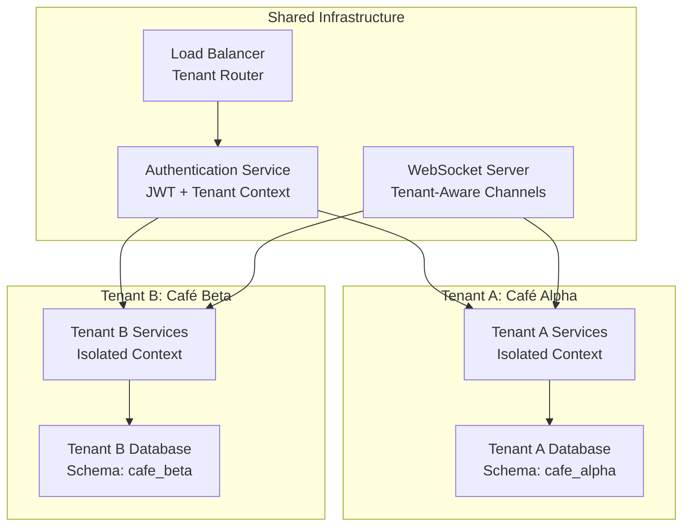
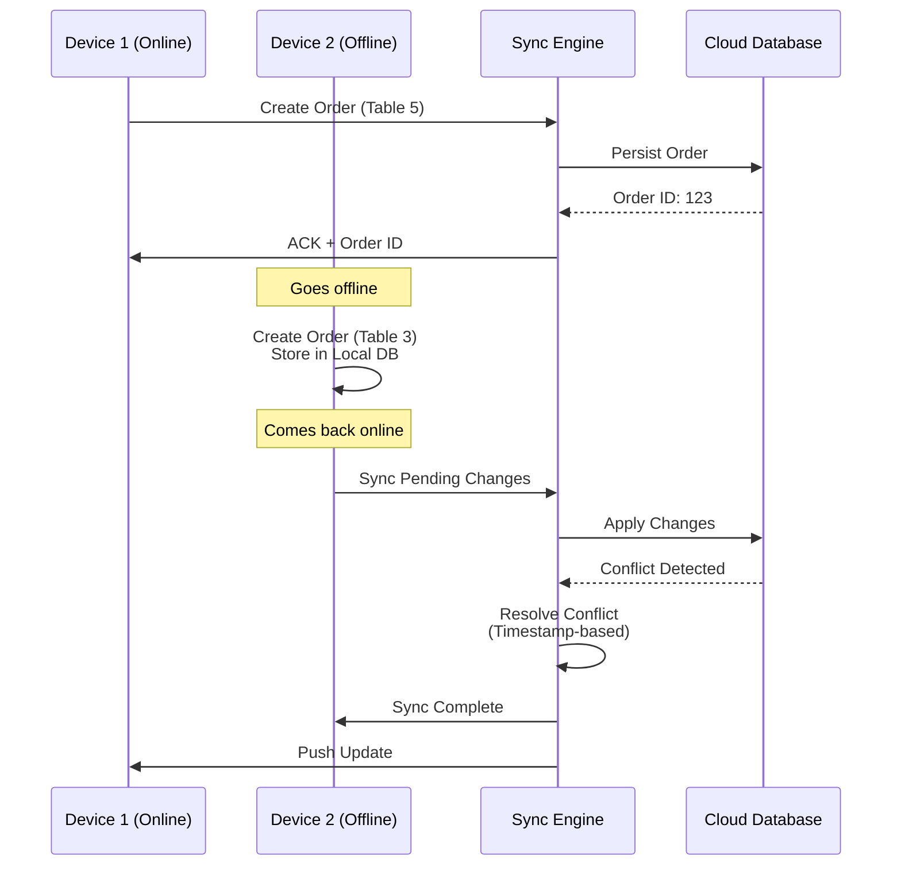
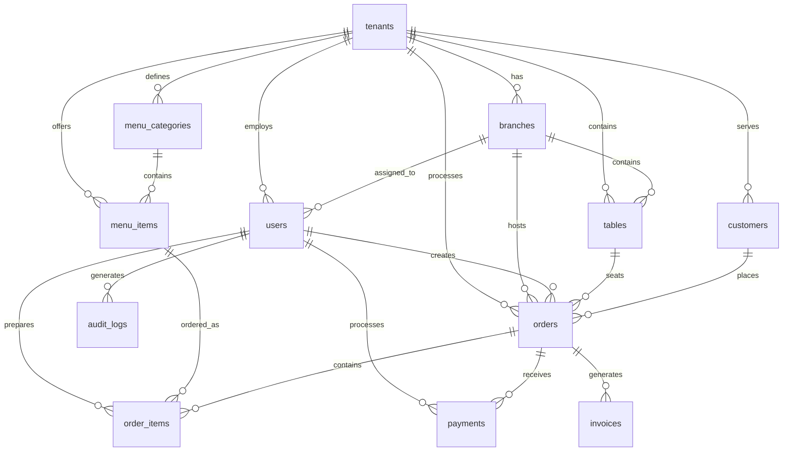
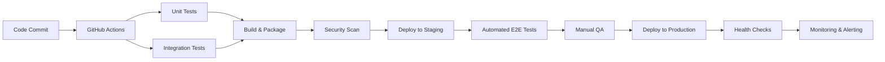

# Design Document: Sky Nether Café Management System

## Overview

Sky Nether is a cloud-based Software-as-a-Service (SaaS) café management system designed to provide café owners with a comprehensive, real-time solution for managing their operations. The system supports multi-tenant architecture, enabling complete data isolation between different café businesses while providing robust features for order management, staff coordination, billing, and analytics.

### Key Design Principles

1. **Multi-Tenant First**: Every component is designed with tenant isolation as a core requirement
2. **Real-Time Responsiveness**: All user interactions provide immediate feedback with efficient data synchronization
3. **Offline Resilience**: System remains functional during internet outages with automatic conflict resolution
4. **Role-Based Security**: Granular permissions enforce business workflows and data access controls
5. **Scalable Architecture**: Designed to handle growth from single café to multiple branches
6. **Modern UX**: Clean, minimalist interface optimized for both desktop and mobile use

### System Context

```
┌─────────────────────────────────────────────────────────────┐
│                     External Systems                         │
├─────────────────────────────────────────────────────────────┤
│ Payment Gateways  │  Cloud Storage  │  Email/SMS Services   │
│ (Stripe, PayPal)  │   (S3, Blob)    │   (SendGrid, Twilio)  │
└───────────────────┴─────────────────┴───────────────────────┘
                             │
┌─────────────────────────────────────────────────────────────┐
│                    Sky Nether Platform                       │
├─────────────────────────────────────────────────────────────┤
│                   Application Layer                          │
│  ┌─────────────┐ ┌─────────────┐ ┌─────────────┐           │
│  │    Web UI   │ │  Mobile App │ │ Admin Panel │           │
│  │  (Next.js)  │ │(React Native)│ │  (Next.js)  │           │
│  └─────────────┘ └─────────────┘ └─────────────┘           │
│                             │                               │
│                   API Gateway & Auth Layer                  │
│  ┌─────────────────────────────────────────────────────┐   │
│  │            Load Balancer + API Gateway              │   │
│  │         (Tenant Routing + Rate Limiting)            │   │
│  └─────────────────────────────────────────────────────┘   │
│                             │                               │
│                  Business Logic Services                    │
│  ┌─────────┐ ┌─────────┐ ┌─────────┐ ┌─────────┐           │
│  │  Order  │ │  Menu   │ │  Billing│ │  Report │           │
│  │ Service │ │ Service │ │ Service │ │ Service │           │
│  └─────────┘ └─────────┘ └─────────┘ └─────────┘           │
│        │           │           │           │               │
│                  Data Access & Sync Layer                   │
│  ┌─────────────────────────────────────────────────────┐   │
│  │         Real-Time Sync Engine (WebSocket)           │   │
│  │           Conflict Resolution Engine                │   │
│  │          Offline Storage (IndexedDB)                │   │
│  └─────────────────────────────────────────────────────┘   │
│                             │                               │
│                    Data Storage Layer                       │
│  ┌─────────────────────────────────────────────────────┐   │
│  │         Multi-Tenant PostgreSQL Database            │   │
│  │           (Row-Level Security + Schema)             │   │
│  └─────────────────────────────────────────────────────┘   │
└─────────────────────────────────────────────────────────────┘
```

## Architecture

### Multi-Tenant Architecture

The system implements a **database-per-tenant** approach for maximum isolation and scalability:



#### Tenant Isolation Strategies

1. **Database Level**: Separate schemas for each tenant
2. **Application Level**: Tenant context injection in all service calls
3. **Row-Level Security**: PostgreSQL policies for additional protection
4. **API Routing**: Tenant-specific subdomains or headers

### Real-Time Synchronization Architecture



### Offline-First Architecture

The system implements an **offline-first** approach using local storage with eventual consistency:

```
┌─────────────────────────────────────────────────────┐
│                    Client Device                     │
├─────────────────────────────────────────────────────┤
│            Application Layer (React/RN)              │
│  ┌─────────────────────────────────────────────┐    │
│  │         Offline Data Manager                │    │
│  │  • Queue Management                         │    │
│  │  • Conflict Detection                       │    │
│  │  • Retry Logic                              │    │
│  └─────────────────────────────────────────────┘    │
│                              │                       │
│                  Local Storage Layer                 │
│  ┌─────────────────────────────────────────────┐    │
│  │         IndexedDB / SQLite                  │    │
│  │  • Orders (Pending, Synced)                 │    │
│  │  • Menu Items (Cached)                      │    │
│  │  • Customer Data                            │    │
│  │  • Sync Queue                               │    │
│  └─────────────────────────────────────────────┘    │
│                              │                       │
│                 Network Status Monitor               │
│  ┌─────────────────────────────────────────────┐    │
│  │  • Connection Detection                     │    │
│  │  • Bandwidth Assessment                     │    │
│  │  • Auto-Sync Trigger                        │    │
│  └─────────────────────────────────────────────┘    │
└─────────────────────────────────────────────────────┘
```

## Components and Interfaces

### Core Service Components

#### 1. Authentication & Authorization Service
- **Purpose**: Manage user authentication, session management, and role-based access control
- **Interfaces**:
  - `POST /api/auth/login` - User authentication
  - `POST /api/auth/logout` - Session termination
  - `GET /api/auth/session` - Session validation
  - `POST /api/auth/refresh` - Token refresh
- **Technologies**: JWT with refresh tokens, Redis for session storage

#### 2. Tenant Management Service
- **Purpose**: Handle tenant lifecycle, subscription management, and resource allocation
- **Interfaces**:
  - `POST /api/tenants` - Create new tenant (café)
  - `GET /api/tenants/{id}` - Retrieve tenant details
  - `PUT /api/tenants/{id}/subscription` - Update subscription
  - `POST /api/tenants/{id}/branches` - Add new branch

#### 3. Order Management Service
- **Purpose**: Handle order lifecycle from creation to completion
- **Interfaces**:
  - `POST /api/orders` - Create new order
  - `GET /api/orders/{id}` - Retrieve order details
  - `PUT /api/orders/{id}/status` - Update order status
  - `GET /api/orders?table={id}&status={status}` - Filter orders
  - `POST /api/orders/{id}/items` - Add items to order
  - `DELETE /api/orders/{id}/items/{itemId}` - Remove item from order

#### 4. Menu Management Service
- **Purpose**: Manage menu items, categories, pricing, and availability
- **Interfaces**:
  - `GET /api/menu/items` - List all menu items
  - `POST /api/menu/items` - Create new menu item
  - `PUT /api/menu/items/{id}` - Update menu item
  - `DELETE /api/menu/items/{id}` - Delete menu item (soft delete)
  - `PUT /api/menu/items/{id}/availability` - Update availability status

#### 5. Real-Time Sync Service
- **Purpose**: Handle WebSocket connections and real-time data synchronization
- **Interfaces**:
  - WebSocket: `ws://api.skynether.com/sync` - Real-time updates
  - `POST /api/sync/push` - Bulk data push for offline sync
  - `GET /api/sync/pull?since={timestamp}` - Get changes since timestamp
  - `POST /api/sync/resolve-conflict` - Manual conflict resolution

#### 6. Billing & Invoicing Service
- **Purpose**: Process payments, generate invoices, and manage financial records
- **Interfaces**:
  - `POST /api/billing/process` - Process payment for order
  - `GET /api/billing/invoices/{id}` - Retrieve invoice
  - `POST /api/billing/invoices/{id}/email` - Email invoice to customer
  - `GET /api/billing/reports/daily?date={date}` - Daily sales report

#### 7. Kitchen Display Service
- **Purpose**: Provide real-time order display for kitchen staff
- **Interfaces**:
  - WebSocket: `ws://api.skynether.com/kitchen/{tenantId}` - Kitchen order updates
  - `PUT /api/kitchen/orders/{id}/items/{itemId}/status` - Update item preparation status
  - `POST /api/kitchen/orders/{id}/ready` - Mark order as ready for service

#### 8. Notification Service
- **Purpose**: Manage system notifications and alerts
- **Interfaces**:
  - WebSocket: `ws://api.skynether.com/notifications/{userId}` - User notifications
  - `POST /api/notifications` - Create notification
  - `PUT /api/notifications/{id}/read` - Mark as read
  - `GET /api/notifications/unread` - Get unread notifications

### Frontend Components

#### Web Application (Next.js)
- **Layout Components**:
  - `TenantLayout` - Tenant-specific layout with navigation
  - `RoleBasedLayout` - Layout variations based on user role
  - `ResponsiveLayout` - Adaptive layout for different screen sizes
  
- **Core Modules**:
  - `OrderTakingModule` - Tablet-optimized order interface
  - `TableManagementModule` - Interactive floor plan
  - `MenuEditorModule` - Drag-and-drop menu management
  - `ReportingDashboard` - Interactive charts and analytics
  - `StaffManagementModule` - User and schedule management

#### Mobile Application (React Native)
- **Core Screens**:
  - `OrderScreen` - Quick order taking for wait staff
  - `TableScreen` - Table status and management
  - `KitchenScreen` - Order preparation tracking
  - `PaymentScreen` - Mobile payment processing

## Data Models

### Core Entities

```sql
-- Tenant Management
CREATE TABLE tenants (
    id UUID PRIMARY KEY DEFAULT gen_random_uuid(),
    name VARCHAR(255) NOT NULL,
    subdomain VARCHAR(63) UNIQUE NOT NULL,
    plan VARCHAR(50) NOT NULL DEFAULT 'starter',
    status VARCHAR(20) NOT NULL DEFAULT 'active',
    created_at TIMESTAMP WITH TIME ZONE DEFAULT NOW(),
    updated_at TIMESTAMP WITH TIME ZONE DEFAULT NOW()
);

-- Branch/Location within Tenant
CREATE TABLE branches (
    id UUID PRIMARY KEY DEFAULT gen_random_uuid(),
    tenant_id UUID NOT NULL REFERENCES tenants(id),
    name VARCHAR(255) NOT NULL,
    address TEXT,
    phone VARCHAR(50),
    timezone VARCHAR(50) NOT NULL DEFAULT 'UTC',
    is_active BOOLEAN NOT NULL DEFAULT TRUE,
    created_at TIMESTAMP WITH TIME ZONE DEFAULT NOW()
);

-- Users with Role-Based Access
CREATE TABLE users (
    id UUID PRIMARY KEY DEFAULT gen_random_uuid(),
    tenant_id UUID NOT NULL REFERENCES tenants(id),
    branch_id UUID REFERENCES branches(id),
    email VARCHAR(255) NOT NULL,
    password_hash VARCHAR(255) NOT NULL,
    first_name VARCHAR(100) NOT NULL,
    last_name VARCHAR(100) NOT NULL,
    role VARCHAR(50) NOT NULL CHECK (role IN ('owner', 'manager', 'cashier', 'waiter', 'chef')),
    is_active BOOLEAN NOT NULL DEFAULT TRUE,
    last_login_at TIMESTAMP WITH TIME ZONE,
    created_at TIMESTAMP WITH TIME ZONE DEFAULT NOW(),
    UNIQUE(tenant_id, email)
);

-- Menu Management
CREATE TABLE menu_categories (
    id UUID PRIMARY KEY DEFAULT gen_random_uuid(),
    tenant_id UUID NOT NULL REFERENCES tenants(id),
    name VARCHAR(100) NOT NULL,
    description TEXT,
    display_order INTEGER NOT NULL DEFAULT 0,
    is_active BOOLEAN NOT NULL DEFAULT TRUE,
    created_at TIMESTAMP WITH TIME ZONE DEFAULT NOW()
);

CREATE TABLE menu_items (
    id UUID PRIMARY KEY DEFAULT gen_random_uuid(),
    tenant_id UUID NOT NULL REFERENCES tenants(id),
    category_id UUID REFERENCES menu_categories(id),
    name VARCHAR(255) NOT NULL,
    description TEXT,
    price DECIMAL(10,2) NOT NULL CHECK (price >= 0),
    cost DECIMAL(10,2) CHECK (cost >= 0),
    preparation_time INTEGER, -- in minutes
    is_available BOOLEAN NOT NULL DEFAULT TRUE,
    display_order INTEGER NOT NULL DEFAULT 0,
    tags JSONB DEFAULT '[]',
    created_at TIMESTAMP WITH TIME ZONE DEFAULT NOW(),
    updated_at TIMESTAMP WITH TIME ZONE DEFAULT NOW()
);

-- Table/Floor Management
CREATE TABLE tables (
    id UUID PRIMARY KEY DEFAULT gen_random_uuid(),
    tenant_id UUID NOT NULL REFERENCES tenants(id),
    branch_id UUID NOT NULL REFERENCES branches(id),
    table_number VARCHAR(20) NOT NULL,
    table_name VARCHAR(100),
    capacity INTEGER NOT NULL CHECK (capacity > 0),
    position_x INTEGER,
    position_y INTEGER,
    status VARCHAR(20) NOT NULL DEFAULT 'available' CHECK (status IN ('available', 'occupied', 'reserved', 'cleaning')),
    current_order_id UUID, -- References orders(id)
    created_at TIMESTAMP WITH TIME ZONE DEFAULT NOW()
);

-- Order Management
CREATE TABLE orders (
    id UUID PRIMARY KEY DEFAULT gen_random_uuid(),
    tenant_id UUID NOT NULL REFERENCES tenants(id),
    branch_id UUID NOT NULL REFERENCES branches(id),
    table_id UUID REFERENCES tables(id),
    customer_id UUID REFERENCES customers(id),
    order_number VARCHAR(50) NOT NULL,
    status VARCHAR(20) NOT NULL DEFAULT 'pending' CHECK (status IN ('pending', 'confirmed', 'preparing', 'ready', 'served', 'cancelled', 'paid')),
    total_amount DECIMAL(10,2) NOT NULL DEFAULT 0 CHECK (total_amount >= 0),
    tax_amount DECIMAL(10,2) NOT NULL DEFAULT 0,
    service_charge DECIMAL(10,2) DEFAULT 0,
    discount_amount DECIMAL(10,2) DEFAULT 0,
    final_amount DECIMAL(10,2) NOT NULL DEFAULT 0,
    notes TEXT,
    served_by UUID REFERENCES users(id),
    created_by UUID NOT NULL REFERENCES users(id),
    created_at TIMESTAMP WITH TIME ZONE DEFAULT NOW(),
    updated_at TIMESTAMP WITH TIME ZONE DEFAULT NOW(),
    served_at TIMESTAMP WITH TIME ZONE,
    paid_at TIMESTAMP WITH TIME ZONE
);

CREATE TABLE order_items (
    id UUID PRIMARY KEY DEFAULT gen_random_uuid(),
    order_id UUID NOT NULL REFERENCES orders(id),
    menu_item_id UUID NOT NULL REFERENCES menu_items(id),
    quantity INTEGER NOT NULL CHECK (quantity > 0),
    unit_price DECIMAL(10,2) NOT NULL CHECK (unit_price >= 0),
    total_price DECIMAL(10,2) NOT NULL CHECK (total_price >= 0),
    special_instructions TEXT,
    status VARCHAR(20) NOT NULL DEFAULT 'pending' CHECK (status IN ('pending', 'preparing', 'ready', 'served', 'cancelled')),
    prepared_by UUID REFERENCES users(id),
    created_at TIMESTAMP WITH TIME ZONE DEFAULT NOW(),
    updated_at TIMESTAMP WITH TIME ZONE DEFAULT NOW()
);

-- Payment and Invoicing
CREATE TABLE payments (
    id UUID PRIMARY KEY DEFAULT gen_random_uuid(),
    tenant_id UUID NOT NULL REFERENCES tenants(id),
    order_id UUID NOT NULL REFERENCES orders(id),
    payment_method VARCHAR(50) NOT NULL CHECK (payment_method IN ('cash', 'card', 'digital_wallet', 'bank_transfer')),
    amount DECIMAL(10,2) NOT NULL CHECK (amount > 0),
    reference_number VARCHAR(100),
    status VARCHAR(20) NOT NULL DEFAULT 'pending' CHECK (status IN ('pending', 'completed', 'failed', 'refunded')),
    processed_by UUID REFERENCES users(id),
    processed_at TIMESTAMP WITH TIME ZONE DEFAULT NOW(),
    created_at TIMESTAMP WITH TIME ZONE DEFAULT NOW()
);

CREATE TABLE invoices (
    id UUID PRIMARY KEY DEFAULT gen_random_uuid(),
    tenant_id UUID NOT NULL REFERENCES tenants(id),
    order_id UUID NOT NULL REFERENCES orders(id),
    invoice_number VARCHAR(50) NOT NULL,
    pdf_url VARCHAR(500),
    emailed_to VARCHAR(255),
    emailed_at TIMESTAMP WITH TIME ZONE,
    created_at TIMESTAMP WITH TIME ZONE DEFAULT NOW()
);

-- Customer Management
CREATE TABLE customers (
    id UUID PRIMARY KEY DEFAULT gen_random_uuid(),
    tenant_id UUID NOT NULL REFERENCES tenants(id),
    phone_number VARCHAR(50) UNIQUE,
    email VARCHAR(255),
    first_name VARCHAR(100),
    last_name VARCHAR(100),
    loyalty_points INTEGER DEFAULT 0,
    total_orders INTEGER DEFAULT 0,
    total_spent DECIMAL(10,2) DEFAULT 0,
    last_order_at TIMESTAMP WITH TIME ZONE,
    created_at TIMESTAMP WITH TIME ZONE DEFAULT NOW()
);

-- Audit and Activity Logging
CREATE TABLE audit_logs (
    id UUID PRIMARY KEY DEFAULT gen_random_uuid(),
    tenant_id UUID NOT NULL REFERENCES tenants(id),
    user_id UUID REFERENCES users(id),
    action_type VARCHAR(100) NOT NULL,
    entity_type VARCHAR(100) NOT NULL,
    entity_id UUID,
    old_values JSONB,
    new_values JSONB,
    ip_address INET,
    user_agent TEXT,
    created_at TIMESTAMP WITH TIME ZONE DEFAULT NOW()
);

-- Sync and Offline Management
CREATE TABLE sync_metadata (
    id UUID PRIMARY KEY DEFAULT gen_random_uuid(),
    tenant_id UUID NOT NULL REFERENCES tenants(id),
    entity_type VARCHAR(100) NOT NULL,
    entity_id UUID NOT NULL,
    last_modified_at TIMESTAMP WITH TIME ZONE NOT NULL,
    device_id VARCHAR(100),
    sync_status VARCHAR(20) NOT NULL DEFAULT 'pending' CHECK (sync_status IN ('pending', 'synced', 'conflict')),
    version INTEGER NOT NULL DEFAULT 1,
    created_at TIMESTAMP WITH TIME ZONE DEFAULT NOW()
);
```

### Data Relationships



### Indexing Strategy

1. **Tenant-based partitioning**: All tables include `tenant_id` as first column in composite indexes
2. **Frequent queries**: Indexes on `status`, `created_at`, `updated_at` for order and table queries
3. **Real-time lookups**: Indexes on `order_number`, `table_id`, `customer_id`
4. **Sync optimization**: Indexes on `sync_metadata(last_modified_at, entity_type)`

## Technology Stack

### Backend Services
- **Runtime**: Node.js 18+ with TypeScript
- **Framework**: NestJS for structured, scalable architecture
- **API Design**: RESTful APIs with OpenAPI/Swagger documentation
- **Real-time**: Socket.IO for WebSocket communications
- **Authentication**: JWT with refresh tokens, Redis session store
- **Validation**: class-validator, class-transformer for DTO validation

### Database & Storage
- **Primary Database**: PostgreSQL 14+ with Row-Level Security
- **Caching**: Redis for sessions, rate limiting, and hot data
- **Object Storage**: AWS S3 or equivalent for PDF invoices and backups
- **Search**: PostgreSQL full-text search for menu items and orders

### Frontend Applications
- **Web Application**: Next.js 14+ with React, TypeScript, Tailwind CSS
- **Mobile Application**: React Native with Expo for cross-platform support
- **State Management**: Zustand for lightweight state management
- **Real-time Updates**: Socket.IO client with automatic reconnection
- **Offline Storage**: IndexedDB (web) and SQLite (mobile)
- **UI Components**: Custom design system with Radix UI primitives

### Infrastructure & DevOps
- **Containerization**: Docker for consistent environments
- **Orchestration**: Kubernetes for scalable deployment
- **CI/CD**: GitHub Actions with automated testing and deployment
- **Monitoring**: Prometheus, Grafana, and structured logging
- **Alerting**: PagerDuty or equivalent for production incidents
- **Backups**: Automated daily backups with point-in-time recovery

### Third-Party Integrations
- **Payment Processing**: Stripe or similar with PCI compliance
- **Email/SMS**: SendGrid, Twilio, or AWS SES/SNS
- **PDF Generation**: PDFKit or similar for invoice generation
- **Printing**: Cloud printing services or local printer drivers
- **Analytics**: Mixpanel or Amplitude for user behavior tracking

## Security Considerations

### Authentication & Authorization
1. **Multi-factor Authentication**: Optional MFA for Owner and Manager roles
2. **Password Policies**: Minimum 12 characters with complexity requirements
3. **Session Management**: Secure, HttpOnly cookies with CSRF protection
4. **Rate Limiting**: IP-based and user-based rate limiting on authentication endpoints
5. **JWT Security**: Short-lived access tokens (15 minutes) with refresh token rotation

### Data Protection
1. **Encryption at Rest**: AES-256 encryption for sensitive data (passwords, payment info)
2. **Encryption in Transit**: TLS 1.3 for all API communications
3. **Data Masking**: Partial data exposure based on user role (e.g., chefs see order details but not prices)
4. **Audit Trail**: Immutable logging of all sensitive operations
5. **Data Retention**: Configurable retention policies with automated data purging

### Tenant Isolation
1. **Database Isolation**: Separate schemas with PostgreSQL RLS policies
2. **Network Isolation**: Tenant-specific API routing and middleware
3. **Resource Limits**: Tenant-level quotas for API calls, storage, and concurrent users
4. **Cross-Tenant Protection**: Middleware to prevent tenant ID injection attacks

### Payment Security
1. **PCI Compliance**: Tokenization of payment data, no raw card data storage
2. **Payment Isolation**: Separate payment processor accounts per tenant
3. **Fraud Detection**: Basic fraud rules (velocity checks, unusual amounts)
4. **Receipt Security**: Signed PDF invoices with tamper detection

### Application Security
1. **Input Validation**: Comprehensive validation on all API endpoints
2. **SQL Injection Prevention**: Parameterized queries with TypeORM/Prisma
3. **XSS Protection**: Content Security Policy, input sanitization
4. **CORS Configuration**: Strict origin validation for API access
5. **Security Headers**: HSTS, X-Frame-Options, Content-Security-Policy

## Scalability Considerations

### Horizontal Scaling Strategy
1. **Stateless Services**: Authentication and API services designed as stateless
2. **Database Scaling**: Read replicas for reporting, connection pooling
3. **Cache Distribution**: Redis cluster for distributed caching
4. **WebSocket Scaling**: Socket.IO with Redis adapter for multiple instances

### Tenant Growth Management
1. **Resource Allocation**: Dynamic resource allocation based on subscription tier
2. **Performance Isolation**: Tenant-aware load balancing and resource quotas
3. **Database Partitioning**: Schema-based isolation with potential for physical separation at scale
4. **Monitoring per Tenant**: Tenant-level performance metrics and alerting

### Performance Optimization
1. **Query Optimization**: Tenant-specific query plans, materialized views for reports
2. **Caching Strategy**: Multi-level caching (Redis, CDN, browser)
3. **Connection Management**: Database connection pooling with tenant context
4. **Asset Optimization**: Image compression, code splitting, lazy loading

### Disaster Recovery
1. **Multi-Region Deployment**: Active-active deployment across regions
2. **Data Replication**: Cross-region database replication with RPO < 5 minutes
3. **Backup Strategy**: Daily full backups with hourly incremental backups
4. **Recovery Procedures**: Automated recovery playbooks with documented RTO/RPO

## Performance Considerations

### Response Time Targets
1. **Critical Path Operations**:
   - Order creation: < 200ms
   - Menu item lookup: < 100ms
   - Table status update: < 150ms
   - Payment processing: < 500ms

2. **User Experience Operations**:
   - Page load (cached): < 1s
   - Page load (uncached): < 3s
   - Real-time updates: < 2s propagation
   - Report generation: < 5s for daily, < 30s for monthly

### Database Performance
1. **Indexing Strategy**: Composite indexes on `(tenant_id, created_at)` for time-based queries
2. **Query Optimization**: Prepared statements with tenant context
3. **Connection Pooling**: Configurable pool sizes per tenant tier
4. **Read/Write Separation**: Report queries routed to read replicas

### Frontend Performance
1. **Bundle Optimization**: Code splitting by feature module
2. **Asset Loading**: Progressive loading of images and data
3. **Caching Strategy**: Service Worker for offline assets
4. **Render Optimization**: Virtualized lists for large datasets

### Network Optimization
1. **Compression**: Brotli compression for API responses
2. **CDN Usage**: Static assets served via CDN
3. **Protocol Optimization**: HTTP/2 with server push for critical resources
4. **Payload Optimization**: Delta updates for real-time synchronization

## Deployment Architecture

### Production Environment
```
┌─────────────────────────────────────────────────────────────┐
│                     Cloud Provider (AWS)                     │
├─────────────────────────────────────────────────────────────┤
│                      Load Balancer Layer                     │
│  ┌─────────────────────────────────────────────────────┐    │
│  │            Application Load Balancer                │    │
│  │         (SSL Termination + Routing)                 │    │
│  └─────────────────────────────────────────────────────┘    │
│                              │                               │
│                    Kubernetes Cluster                        │
│  ┌─────────────────────────────────────────────────────┐    │
│  │                   Worker Nodes                      │    │
│  │  ┌─────────────┐ ┌─────────────┐ ┌─────────────┐   │    │
│  │  │   API Pods  │ │  Web Pods   │ │  Sync Pods  │   │    │
│  │  │  (NestJS)   │ │  (Next.js)  │ │ (Socket.IO) │   │    │
│  │  └─────────────┘ └─────────────┘ └─────────────┘   │    │
│  │  ┌─────────────┐ ┌─────────────┐ ┌─────────────┐   │    │
│  │  │ Auth Pods   │ │  Job Pods   │ │  Cache Pods │   │    │
│  │  │ (JWT/Redis) │ │ (Queues)    │ │   (Redis)   │   │    │
│  │  └─────────────┘ └─────────────┘ └─────────────┘   │    │
│  └─────────────────────────────────────────────────────┘    │
│                              │                               │
│                     Database Layer                           │
│  ┌────────────────────────────��────────────────────────┐    │
│  │         PostgreSQL RDS (Multi-AZ)                   │    │
│  │  • Primary Instance                                 │    │
│  │  • Read Replicas (2+)                               │    │
│  │  • Automated Backups                               │    │
│  └─────────────────────────────────────────────────────┘    │
│                              │                               │
│                     Storage Layer                           │
│  ┌─────────────────────────────────────────────────────┐    │
│  │                 S3 Buckets                          │    │
│  │  • Invoice PDFs                                    │    │
│  │  • Backup Archives                                 │    │
│  │  • Static Assets                                   │    │
│  └─────────────────────────────────────────────────────┘    │
└─────────────────────────────────────────────────────────────┘
```

### Development & Staging Environments
1. **Development**: Local Docker Compose with mocked services
2. **Staging**: Isolated Kubernetes namespace with production-like configuration
3. **Feature Branches**: Ephemeral environments for pull request testing
4. **Performance Testing**: Dedicated load testing environment

### Deployment Pipeline


### Monitoring & Observability
1. **Application Metrics**: Request rates, error rates, response times
2. **Business Metrics**: Orders per hour, revenue, active users
3. **Infrastructure Metrics**: CPU, memory, disk I/O, network
4. **Tenant Metrics**: Per-tenant performance and usage
5. **Alerting**: Multi-level alerts (warning, critical) with escalation policies

## API Design Principles

### RESTful API Guidelines
1. **Resource-Oriented**: Nouns for resources, HTTP verbs for actions
2. **Versioning**: URL versioning (`/api/v1/orders`)
3. **Consistent Responses**: Standardized error formats and pagination
4. **Hypermedia**: Optional HATEOAS links for discoverability

### Real-Time API Design
1. **WebSocket Channels**: Tenant-specific channels for real-time updates
2. **Event Types**: Structured event payloads with type discrimination
3. **Connection Management**: Automatic reconnection with backoff
4. **Subscription Model**: Client subscribes to specific data streams

### Offline API Design
1. **Queue-Based**: Local operation queue with retry logic
2. **Conflict Detection**: Version-based conflict detection
3. **Bulk Operations**: Optimized bulk sync endpoints
4. **State Reconciliation**: Client-side state reconciliation after sync

### API Security
1. **Authentication**: Bearer tokens with tenant context
2. **Authorization**: Role-based access control at endpoint level
3. **Rate Limiting**: Tenant-aware rate limiting
4. **Input Validation**: Comprehensive schema validation
5. **Output Sanitization**: Data masking based on user role

## Correctness Properties

*A property is a characteristic or behavior that should hold true across all valid executions of a system-essentially, a formal statement about what the system should do. Properties serve as the bridge between human-readable specifications and machine-verifiable correctness guarantees.*

Based on the prework analysis of 66 acceptance criteria, we have identified 32 properties suitable for property-based testing (PBT), 18 integration tests, 8 example-based tests, 4 smoke tests, 4 performance tests, and 4 non-testable requirements.

### Property 1: Tenant Data Isolation

*For any* user and any data access operation (read, write, update, delete), the system SHALL only permit access to data belonging to the user's tenant, preventing cross-tenant data exposure.

**Validates: Requirements 1.2, 1.4**

### Property 2: Authentication and Session Consistency

*For any* user credentials (valid or invalid), the authentication system SHALL correctly verify credentials and, upon successful authentication, create a secure session with appropriate role permissions that matches the user's assigned role.

**Validates: Requirements 2.1, 2.2**

### Property 3: Comprehensive Role-Based Access Control

*For any* user with a specific role (Owner, Manager, Cashier, Waiter, Chef) attempting any system operation, the RBAC system SHALL enforce permissions consistently according to role definitions, preventing unauthorized access to features and data.

**Validates: Requirements 2.3, 3.1, 8.1, 8.2, 12.2**

### Property 4: Menu Item Lifecycle Management

*For any* menu item data (name, description, price, category, availability), the menu management system SHALL correctly support the full CRUD lifecycle (create, read, update, delete/soft-delete) while maintaining data integrity and relationships.

**Validates: Requirements 3.2**

### Property 5: Order Price Calculation Consistency

*For any* order configuration (items, quantities, modifiers, taxes, service charges), the system SHALL calculate prices consistently throughout the order lifecycle, applying price changes immediately to new orders while preserving prices on existing orders, and correctly computing final totals including all applicable charges.

**Validates: Requirements 3.4, 5.2, 7.1**

### Property 6: Order and Table State Management

*For any* order or table state transition (pending → preparing → ready → served, available → occupied → available, etc.), the system SHALL enforce valid state transitions based on business rules, user roles, and timing constraints, preventing invalid state changes.

**Validates: Requirements 4.3, 5.4, 5.5, 6.2**

### Property 7: Order Creation and Modification

*For any* order data (table selection, menu items with quantities and special instructions), the order system SHALL correctly create orders, allow authorized modifications before kitchen preparation begins, and reject unavailable menu items.

**Validates: Requirements 5.1, 5.4, 6.2**

### Property 8: Financial Transaction Audit Trail

*For any* financial transaction (payment processing, price modification, refund), the system SHALL create a complete audit trail including timestamp, user identity, before/after values (where applicable), and require appropriate approvals for sensitive modifications.

**Validates: Requirements 7.5, 12.1, 12.3**

### Property 9: Synchronization Consistency and Conflict Resolution

*For any* data modifications across multiple devices (online/offline), the sync system SHALL maintain eventual consistency, correctly resolve conflicts using timestamp-based or type-specific resolution rules, and preserve data integrity throughout synchronization cycles.

**Validates: Requirements 10.2, 10.3, 10.4, 11.4**

### Property 10: Offline Data Persistence and Recovery

*For any* system operations performed while offline (order creation, modifications, transactions), the local storage SHALL correctly persist all data, and upon reconnection, automatically sync to the cloud while maintaining data integrity.

**Validates: Requirements 11.2, 11.3**

### Property 11: Report and Analytics Calculation Accuracy

*For any* sales data across various time periods (daily, weekly, monthly, custom ranges), the analytics system SHALL correctly compute metrics including top-selling items, peak hours, revenue trends, staff performance, and profit margins.

**Validates: Requirements 9.1, 9.2, 9.3, 9.4, 9.5, 16.2**

### Property 12: Subscription and Billing Management

*For any* subscription scenario (monthly/annual cycles, plan changes, expiration), the billing system SHALL correctly calculate charges, enforce access restrictions upon expiration while preserving data, and support billing portal operations.

**Validates: Requirements 15.1, 15.2, 15.3**

### Property 13: Customer Management and Loyalty Tracking

*For any* customer interactions (profile creation, order placement, repeated visits), the customer management system SHALL correctly associate orders with customer profiles, track loyalty metrics, and support customer data operations.

**Validates: Requirements 18.1, 18.2, 18.3**

### Property 14: Data Export and Format Consistency

*For any* business data (sales records, customer orders, financial data), the export system SHALL correctly generate CSV files with accurate data representation and formatting suitable for external systems.

**Validates: Requirements 16.1**

### Property 15: Notification Preference Management

*For any* user notification preferences based on role and customization settings, the notification system SHALL correctly apply preferences and deliver alerts according to user configurations.

**Validates: Requirements 13.2**

### Property 16: Timed Notification Triggers

*For any* order that has been ready for more than the configured timeout period, the system SHALL trigger notifications to appropriate staff members based on timing rules and role assignments.

**Validates: Requirements 13.3**

### Property 17: Notification History Tracking

*For any* system-generated notification, the notification center SHALL maintain a complete history of alerts with correct metadata (timestamp, type, recipient, status) accessible according to user permissions.

**Validates: Requirements 13.4**

### Property 18: Printer Configuration and Queue Management

*For any* printer configuration (kitchen, bar, receipt printers) and print job scenarios (including connectivity failures), the print system SHALL correctly manage configurations, queue jobs during failures, and retry upon reconnection.

**Validates: Requirements 17.2, 17.3**

### Property 19: Print Preview Generation

*For any* print data (order tickets, invoices, receipts), the system SHALL correctly generate print previews that accurately represent what will be sent to printers.

**Validates: Requirements 17.4**

### Property 20: Table Grouping Operations

*For any* combination of tables selected for grouping, the table management system SHALL correctly create and manage table groups for larger parties while maintaining individual table states and order associations.

**Validates: Requirements 4.4**

### Property 21: Staff Schedule Management

*For any* staff schedule data (shifts, assignments, modifications), the schedule management system SHALL correctly support viewing and editing operations with appropriate permission enforcement.

**Validates: Requirements 8.3**

### Property 22: User Account Lifecycle Management

*For any* user account operation (creation, role assignment, deactivation), the staff management system SHALL correctly enforce permission rules (only Owners can assign Owner/Manager roles) and maintain appropriate access controls during deactivation.

**Validates: Requirements 8.2, 8.4**

### Property 23: Order Prioritization Algorithm

*For any* set of orders with varying creation times and table statuses, the kitchen display system SHALL correctly prioritize orders according to business rules (creation time first, then table status considerations).

**Validates: Requirements 6.3**

### Property 24: Payment Method Processing

*For any* payment attempt using supported methods (cash, card, digital wallets), the payment processing system SHALL correctly handle the payment flow, record the transaction, and update order status accordingly.

**Validates: Requirements 7.2**

### Property 25: Data Restoration Workflow

*For any* data restoration scenario from backups, the system SHALL correctly enforce approval requirements (Owner authorization) and restore data while maintaining integrity and relationships.

**Validates: Requirements 16.4**

### Property 26: Menu Availability Enforcement

*For any* order attempt containing menu items marked as unavailable, the order system SHALL prevent those items from being added to new orders while allowing available items to proceed.

**Validates: Requirements 3.3**

### Property 27: Table Selection and Order Association

*For any* table state (available, occupied, reserved) with or without associated orders, the system SHALL correctly display current order details when the table is selected and support appropriate order management operations.

**Validates: Requirements 4.2**

### Property 28: Order Completion Notification

*For any* order where all items have been marked as ready, the system SHALL trigger notifications to wait staff to serve the completed order.

**Validates: Requirements 6.5**

### Property 29: Delta Update Efficiency

*For any* data changes during synchronization, the real-time update system SHALL use efficient delta updates that minimize bandwidth usage by transmitting only changed data rather than complete datasets.

**Validates: Requirements 10.2**

### Property 30: Customer Order Association Rules

*For any* order placed with customer contact information, the system SHALL correctly associate the order with the customer's profile; for orders without contact information, no association shall be created.

**Validates: Requirements 18.2**

### Property 31: Audit Log Access Control

*For any* user attempt to access activity logs, the system SHALL enforce that only Owners and Managers can view audit records, preventing unauthorized access to sensitive activity data.

**Validates: Requirements 12.2**

### Property 32: Order-Table Relationship Integrity

*For any* order created for a specific table, the system SHALL maintain the correct relationship between orders and tables, allowing proper table status updates and order management based on this relationship.

**Validates: Requirements 4.2, 5.1**

## Error Handling

### Graceful Error Recovery

The system implements a multi-layered error handling strategy:

1. **Client-Side Validation**: Immediate feedback for invalid inputs (empty orders, invalid quantities)
2. **Business Rule Validation**: Server-side validation of business rules (unavailable items, invalid state transitions)
3. **Transaction Rollback**: Automatic rollback of failed database transactions
4. **Retry with Exponential Backoff**: For transient failures (network issues, temporary service unavailability)
5. **User-Friendly Error Messages**: Contextual error messages without exposing technical details
6. **Error Logging with Context**: Structured logging of errors with tenant, user, and operation context

### Error Categories and Handling Strategies

#### 1. Validation Errors (HTTP 400)
- **Cause**: Invalid user input or business rule violation
- **Handling**: Return specific error messages, allow user correction
- **Example**: Attempting to add unavailable menu item to order

#### 2. Authentication/Authorization Errors (HTTP 401/403)
- **Cause**: Invalid credentials or insufficient permissions
- **Handling**: Clear permission denial messages, redirect to login if needed
- **Example**: Cashier attempting to access owner-only reports

#### 3. Resource Not Found (HTTP 404)
- **Cause**: Requested resource doesn't exist or user lacks access
- **Handling**: Generic "not found" message to avoid information leakage
- **Example**: Accessing order from another tenant

#### 4. Conflict Errors (HTTP 409)
- **Cause**: Data conflicts during synchronization or concurrent edits
- **Handling**: Present conflict resolution options to user
- **Example**: Offline order conflicts with cloud data

#### 5. Rate Limiting (HTTP 429)
- **Cause**: Too many requests from user or IP
- **Handling**: Inform user of limit, suggest waiting period
- **Example**: Brute force login attempts

#### 6. Server Errors (HTTP 500)
- **Cause**: Internal server errors, database failures
- **Handling**: Generic error message, detailed logging, alert monitoring
- **Example**: Database connection failure

#### 7. Offline Mode Errors
- **Cause**: Network connectivity issues
- **Handling**: Queue operations locally, automatic retry on reconnection
- **Example**: Taking orders during internet outage

### Circuit Breaker Pattern

For external service integrations (payment processing, email/SMS, printing), the system implements the circuit breaker pattern:

```
Closed State (Normal Operation)
    ↓ (Failure threshold exceeded)
Open State (Fail Fast)
    ↓ (Timeout period elapsed)
Half-Open State (Test Recovery)
    ↓ (Success)
Closed State
    ↓ (Failure)
Open State
```

### Dead Letter Queue for Failed Operations

Operations that fail after retries are moved to a dead letter queue for:
1. Manual review and resolution
2. Analysis of failure patterns
3. Potential automated recovery scripts

## Testing Strategy

### Dual Testing Approach

The system employs a comprehensive testing strategy combining property-based testing (PBT) for universal properties and example-based testing for specific scenarios:

#### Unit Testing (Example-Based)
- **Purpose**: Verify specific behaviors, edge cases, and integration points
- **Coverage**: Critical business logic, error conditions, integration boundaries
- **Framework**: Jest for Node.js, React Testing Library for frontend
- **Target**: 80% line coverage for business logic services

#### Property-Based Testing (Universal Properties)
- **Purpose**: Verify universal properties across wide input ranges
- **Coverage**: 32 properties identified in Correctness Properties section
- **Framework**: fast-check for comprehensive property testing
- **Configuration**: Minimum 100 iterations per property, configurable seed for reproducibility

#### Integration Testing
- **Purpose**: Verify component interactions and external service integrations
- **Coverage**: API endpoints, database interactions, external services
- **Framework**: Supertest for API testing, Docker for service isolation
- **Environment**: Isolated test database with tenant-specific schemas

#### End-to-End Testing
- **Purpose**: Verify complete user workflows across the system
- **Coverage**: Critical user journeys (order-to-payment, staff management)
- **Framework**: Cypress for web, Detox for mobile
- **Scope**: Cross-device, cross-role user scenarios

#### Performance Testing
- **Purpose**: Verify system meets performance requirements under load
- **Coverage**: Response times, concurrent users, synchronization latency
- **Framework**: k6 for load testing, Lighthouse for frontend performance
- **Targets**: Login < 2s, order creation < 200ms, sync propagation < 5s

### Test Environment Strategy

#### 1. Local Development
- **Purpose**: Rapid feedback during development
- **Setup**: Docker Compose with all services
- **Database**: Test containers with seeded data
- **External Services**: Mocked versions (payment, email, printing)

#### 2. CI/CD Pipeline
- **Purpose**: Automated quality gates
- **Setup**: GitHub Actions with parallel test execution
- **Database**: Ephemeral test databases per pipeline run
- **Reports**: Combined coverage and test results

#### 3. Staging Environment
- **Purpose**: Pre-production validation
- **Setup**: Isolated Kubernetes namespace
- **Database**: Production-like configuration with test data
- **External Services**: Sandbox versions (Stripe test mode, SendGrid test API)

#### 4. Performance Testing Environment
- **Purpose**: Load and stress testing
- **Setup**: Dedicated environment with monitoring
- **Scale**: Configurable to simulate production load patterns
- **Tools**: Prometheus/Grafana for metrics collection

### Property-Based Test Implementation

Each property test follows this structure:

```typescript
import { fc } from 'fast-check';
import { OrderService } from './order-service';
import { MenuItem } from './models';

describe('Property 5: Order Price Calculation Consistency', () => {
  const orderService = new OrderService();
  
  it('should calculate prices consistently throughout order lifecycle', () => {
    fc.assert(
      fc.property(
        // Generator for random order configurations
        fc.record({
          items: fc.array(
            fc.record({
              menuItem: fc.record({
                price: fc.float({ min: 1, max: 100 }),
                isAvailable: fc.boolean()
              }),
              quantity: fc.integer({ min: 1, max: 10 }),
              modifiers: fc.array(fc.string())
            }),
            { minLength: 1, maxLength: 10 }
          ),
          taxRate: fc.float({ min: 0, max: 0.2 }),
          serviceCharge: fc.float({ min: 0, max: 0.1 })
        }),
        (orderConfig) => {
          // Test implementation
          const order = orderService.createOrder(orderConfig);
          const calculatedTotal = orderService.calculateTotal(order);
          const expectedTotal = // ... calculation logic
          
          // Property assertion
          return Math.abs(calculatedTotal - expectedTotal) < 0.01;
        }
      ),
      {
        numRuns: 100,
        verbose: true,
        seed: 42 // Fixed seed for reproducibility
      }
    );
  });
});
```

### Test Tagging and Organization

Tests are organized and tagged for efficient execution:

```typescript
// Tag format: Feature: {feature}, Property {number}: {property_text}
@tag('Feature: sky-nether-cafe-management, Property 5: Order price calculation consistency')
describe('Property 5 Tests', () => {
  // Test implementations
});

// Role-based test organization
@tag('Role: Cashier')
describe('Cashier Functionality', () => {
  // Tests specific to cashier role
});

// Tenant isolation tests
@tag('Tenant: Isolation')
describe('Multi-Tenant Security', () => {
  // Cross-tenant security tests
});
```

### Test Data Management

#### 1. Test Data Generation
- **Property Tests**: Randomized data using fast-check generators
- **Unit Tests**: Specific test cases covering edge conditions
- **Integration Tests**: Seeded data representing realistic scenarios

#### 2. Test Data Cleanup
- **Transactional Tests**: Automatic rollback of database changes
- **Test Containers**: Ephemeral databases for each test run
- **Data Factory Pattern**: Reusable data creation utilities

#### 3. Performance Test Data
- **Realistic Load Patterns**: Simulated daily café traffic patterns
- **Tenant Scaling**: Tests with varying numbers of tenants and users
- **Data Volume**: Tests with large datasets (10k+ orders, 100+ menu items)

### Continuous Testing Pipeline

```
Code Commit → Pre-commit Hooks → CI Pipeline → Deployment Gates
     ↓              ↓              ↓              ↓
  Linting       Unit Tests    Integration    Performance
  Type Check    (Fast)         Tests         Tests
                Property Tests  E2E Tests     Security Scan
                (100 runs)     (Critical paths)
```

### Monitoring and Quality Metrics

#### 1. Test Coverage Metrics
- **Line Coverage**: Minimum 80% for business logic
- **Branch Coverage**: Minimum 70% for critical decision points
- **Property Coverage**: All 32 correctness properties tested

#### 2. Performance Metrics
- **Test Execution Time**: Unit tests < 2 minutes, full suite < 15 minutes
- **Property Test Efficiency**: 100 iterations in < 30 seconds per property
- **Resource Usage**: Memory and CPU constraints for test environments

#### 3. Quality Gates
- **Zero Test Failures**: Required for deployment to production
- **Performance Thresholds**: All performance tests must pass
- **Security Scans**: No critical vulnerabilities detected
- **Property Test Verification**: All properties must hold for 100 iterations

### Test Maintenance Strategy

#### 1. Flaky Test Management
- **Detection**: Automated flaky test detection in CI
- **Quarantine**: Isolate flaky tests for investigation
- **Resolution**: Root cause analysis and fix within 48 hours

#### 2. Property Test Maintenance
- **Property Review**: Quarterly review of property definitions
- **Generator Updates**: Update data generators as business rules evolve
- **Performance Optimization**: Monitor and optimize slow property tests

#### 3. Test Data Evolution
- **Data Refresh**: Regular updates to test data reflecting real usage patterns
- **Scenario Expansion**: Add new test scenarios based on production issues
- **Regression Suite**: Maintain comprehensive regression test suite

This testing strategy ensures comprehensive validation of the Sky Nether café management system while maintaining development velocity and system reliability.